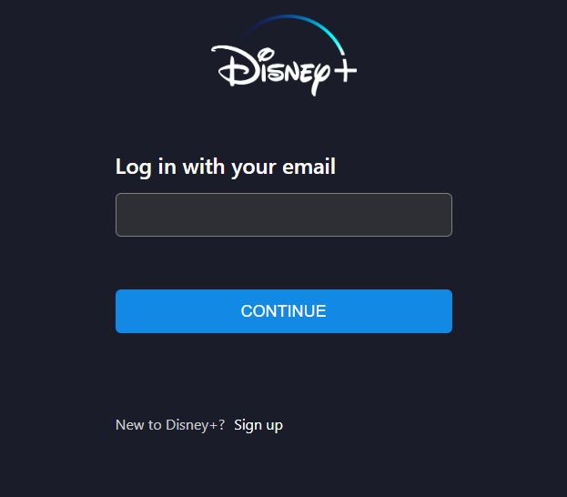

# Disney Plus replica using MongoDB, Express, React, Node and Passport

## A fully functional project to show how to merge these technologies to create a Disney Plus replica.

  

This project, as the title suggests, is a replica of the Disney Plus site. The application allows users to create an account through Passport, where the SALTING feature is added to add protection to the passwords entered.

  

Users can choose a profile picture from the images provided. Also, they have the possibility to update this profile picture at any time. 

  

On the other hand, the WATCHLIST section shows the movies or series that users have added to their list, which indicate with a checkmark SVG that the card has been added. Users can also remove movies from this section by clicking on the SVG. 

  

In total about 21 images were used, a database was created in MongDB to store the user schema and with the help of React the frontend was created.

  

